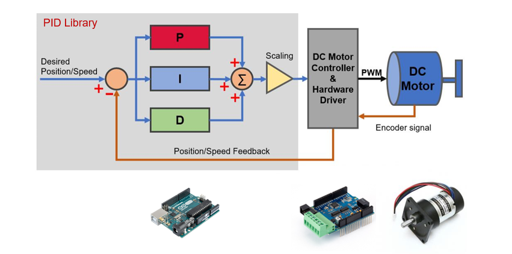
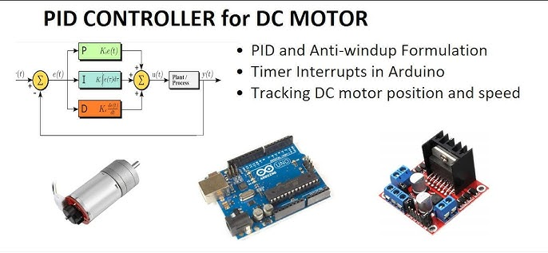
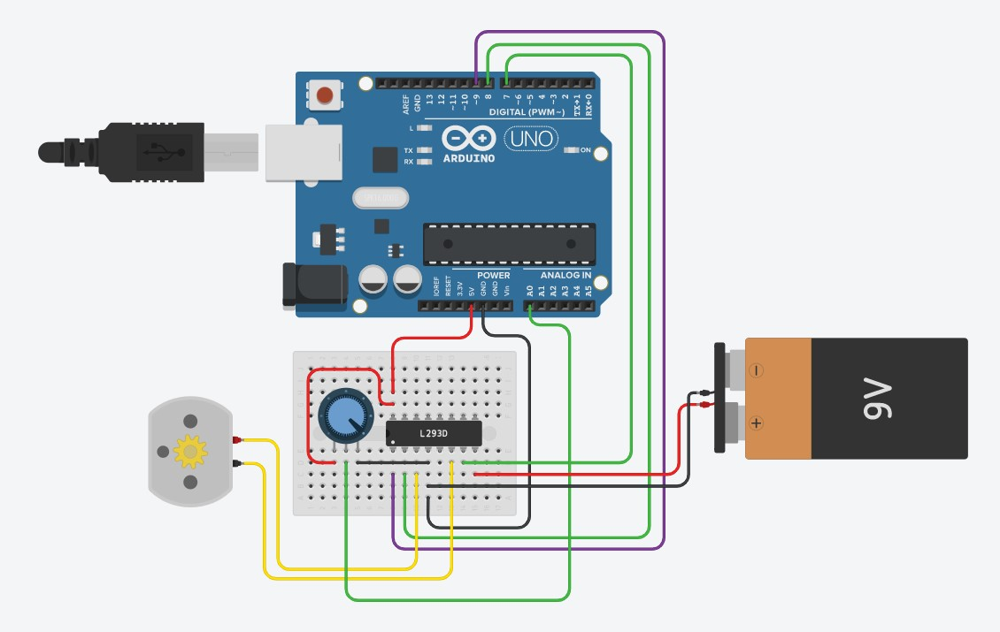
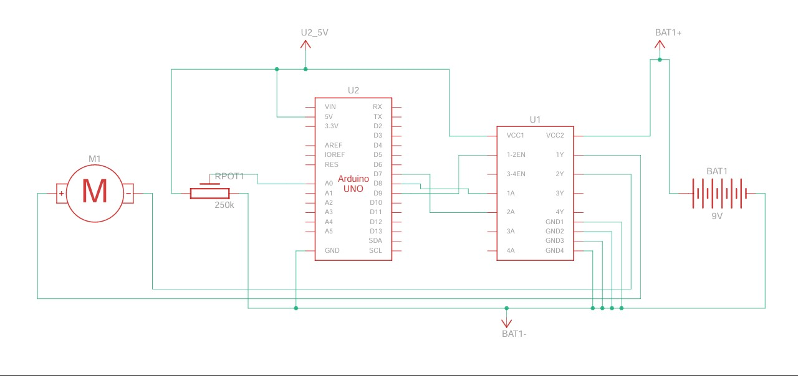

# RPM Control Motor DC with PID

<br/>

<br/>

This project uses an Arduino to control the RPM of a motor using a PID controller. The RPM is measured using an optical sensor, and the motor speed is adjusted accordingly based on the setpoint value.

A PID controller is a type of feedback controller that uses proportional, integral, and derivative terms to adjust the control output based on the error between the desired setpoint and the measured process variable. In the context of a DC motor control system, a PID controller can be used to regulate the motor speed or position.

## Wiring Diagram

 <br>

<br>

## Components Used

- **Arduino Board** (e.g., Arduino Uno)
- **Motor Driver** (e.g., L298N)
- **Optical Sensor** (for RPM measurement)
- **PWM Capable Motor**

## Library Use

- The simulation of the driver motor using IC L293D at Thinkercad <br>
  https://www.tinkercad.com/things/jhi7XCHXMN2-magnificent-kup-jarv.

- The PID library that used in this scheme <br>
  https://github.com/br3ttb/Arduino-PID-Library.

## Pin Definitions

- **SENSOR (Pin 2):** Input pin connected to the optical sensor.
- **VCC (Pin 13):** Output pin used to power the optical sensor.
- **enA (Pin 9):** PWM output pin connected to the motor driver.
- **in1 (Pin 7):** Motor driver input pin 1 (for direction control).
- **in2 (Pin 8):** Motor driver input pin 2 (for direction control).

## PID Control Parameters

- **Aggressive Tuning Parameters:**
  - `aggKp = 0.0992`
  - `aggKi = 0.2027212`
  - `aggKd = 0.0031`
- **Conservative Tuning Parameters:**
  - `consKp = 0`
  - `consKi = 0`
  - `consKd = 0`

## Functionality

1. **Setup:**

   - Initializes pin modes.
   - Configures the PID controller.
   - Sets the target RPM (Setpoint) to 100.
   - Enables serial communication for debugging.
   - Attaches an interrupt to detect pulses from the sensor.

2. **Loop:**

   - Powers the sensor by setting VCC high.
   - Reads the current RPM.
   - Adjusts the PID tuning parameters based on how close the RPM is to the setpoint.
   - Computes the PID output to adjust the motor speed.
   - Sets the motor direction based on the sign of the PWM value.
   - Applies PWM to the motor driver.
   - Prints the Setpoint and RPM to the serial monitor.

3. **RPM Reading:**

   - Disables interrupts during RPM calculation.
   - Calculates RPM based on pulse count and time elapsed.
   - Resets the pulse counter and reattaches the interrupt.

4. **Pulse Detection:**
   - Increments the pulse counter each time a pulse is detected.

## Code

```cpp
#include <PID_v1.h>

#define POT_PIN A0
#define enA 9
#define in2 8
#define in1 7
#define SENSOR 2
#define VCC 13

volatile unsigned int pulseCount = 0; // pulse counter
unsigned long lastTime = 0; // last time a pulse was detected
unsigned int rpm = 0; // revolutions per minute

// Define Variables we'll be connecting to
double Setpoint, Input, Output;

// Define the aggressive and conservative Tuning Parameters
double aggKp = 0.0992, aggKi = 0.2027212, aggKd = 0.0031; // Fixed comma to dot
double consKp = 0, consKi = 0, consKd = 0;

// Specify the links and initial tuning parameters
PID myPID(&Input, &Output, &Setpoint, consKp, consKi, consKd, DIRECT);

void setup() {
  // Set the pins for the motor driver as output
  pinMode(in1, OUTPUT);
  pinMode(in2, OUTPUT);
  pinMode(enA, OUTPUT);

  // Set the pin for the optocoupler sensor as input
  pinMode(SENSOR, INPUT);
  pinMode(VCC, OUTPUT);

  // Set the serial communication baud rate
  Serial.begin(9600);
  attachInterrupt(digitalPinToInterrupt(SENSOR), pulseDetect, RISING);

  // Set the PID control parameters
  Setpoint = 100;  // Target RPM
  myPID.SetMode(AUTOMATIC);  // Enable PID control
}

void loop() {
  digitalWrite(VCC, HIGH);
  rpm = readRPM(); // Use global rpm variable directly

  // Set the input value for the PID control
  Input = rpm;

  // Compute the PID output
  double gap = abs(Setpoint - Input); // Distance away from setpoint
  if (gap < 10) { // We're close to setpoint, use conservative tuning parameters
    myPID.SetTunings(consKp, consKi, consKd);
  } else { // We're far from setpoint, use aggressive tuning parameters
    myPID.SetTunings(aggKp, aggKi, aggKd);
  }

  myPID.Compute();
  int pwmValue = Output;

  // Set the direction of the motor based on the sign of the PWM value
  if (pwmValue > 0) {
    digitalWrite(in1, HIGH);
    digitalWrite(in2, LOW);
  } else {
    digitalWrite(in1, LOW); // Corrected motor direction handling
    digitalWrite(in2, HIGH);
    pwmValue = -pwmValue; // Ensure PWM value is positive for analogWrite
  }

  // Set the PWM value for the motor driver
  analogWrite(enA, pwmValue);

  // Print the RPM and PWM values for debugging
  Serial.print("SET: ");
  Serial.print(Setpoint);
  Serial.print(", RPM: ");
  Serial.println(rpm);
  // Serial.print(", PWM: ");
  // Serial.println(pwmValue);

  // Wait for a short time before the next iteration
  delay(1000);
}

int readRPM() {
  if (millis() - lastTime >= 1000) {
    detachInterrupt(digitalPinToInterrupt(SENSOR)); // Disable interrupt during RPM calculation
    rpm = pulseCount * 60 / 20; // Calculate RPM (20 pulses per revolution)
    pulseCount = 0; // Reset pulse counter
    lastTime = millis(); // Record last measurement time
    attachInterrupt(digitalPinToInterrupt(SENSOR), pulseDetect, RISING); // Re-attach interrupt to sensor pin
  }

  return rpm;
}

void pulseDetect() {
  pulseCount++; // Increment pulse counter
}
```
